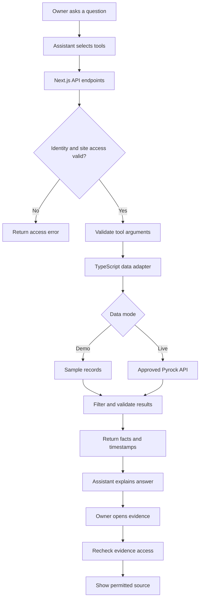

# How I would make the connector work

Proposal by Priyanshu Sinha · October 1, 2026

I’d demonstrate the flow with a question an owner could realistically ask:

> “Site A par cement kitna bacha hai, aur kaunsi delivery pending hai?”

The assistant would choose the tools, Next.js would handle the requests, and the data adapter would retrieve permitted records. The prototype would use sample data; a real integration would use your approved API.

## The request flow

## What happens at each step

1. **Establish the user.** The demo uses controlled sample identities. For live access, I’d use your approved login or delegated authentication flow. Identity comes from authentication, not the assistant’s arguments.
2. **Identify the site.** If “Site A” matches multiple permitted sites, the assistant asks which one the owner means.
3. **Choose the tools.** The assistant requests the material balance and pending deliveries. These reads can run independently once identity and site access are established.
4. **Check the request.** Next.js Route Handlers call shared TypeScript logic to validate arguments and enforce permissions.
5. **Retrieve the records.** The adapter queries sample fixtures or your supported API. Live credentials remain on the server.
6. **Return a useful result.** Include quantities, units, record timestamps, evidence references and any missing-data warning. Keep the result limited to fields the user can access.
7. **Explain it clearly.** The assistant describes recorded stock and pending deliveries separately. It should not present a planned delivery as received material.
8. **Let the owner check the source.** Opening evidence triggers its own permission check. A record reference should not bypass access controls.
9. **Record the request outcome.** Log the user, tool, site, status and latency without exposing credentials or copying full documents into logs by default.

## An example I would use in the demo

| Sample record | Quantity |
|---|---|
| Opening stock | 100 bags |
| Confirmed receipt | 450 bags |
| Recorded usage | 300 bags |
| Delivery still expected | 50 bags |

The answer would be:

> “Site A has 250 cement bags according to the records. Another 50 bags are pending. The stock records were last updated at 10:30 AM. You can view the receipt and usage records behind this answer.”

The calculation is 100 + 450 - 300 = 250. The pending 50 bags are excluded. For a real integration, I would use your definitions for returns, transfers and adjustments rather than assume this simplified calculation covers every case.

## Errors I would make visible

| Situation | What the user should see |
|---|---|
| Not authenticated | A request to connect or sign in. |
| No permission for the site | Access denied without leaking other sites’ details. |
| Missing records | Data unavailable. |
| Old records | The last update time and a freshness warning. |
| API failure | A clear message that the data could not be fetched. |
| Evidence access revoked | The source is no longer available to this user. |

## What I would verify before sharing

I’d check the stock calculation, confirm pending quantities stay out of received stock, test both allowed and denied site access, and independently test evidence permissions. I’d also test missing records and failed requests so the demo handles more than the happy path.

Every demo page would identify sample data. The repository would explain setup, the three tools, known limitations and how a real Pyrock adapter could replace the fixtures.

If we later add corrections, I’d extend this flow through your approval process before any record is changed. That would be a separate milestone after the read-only connector works.
