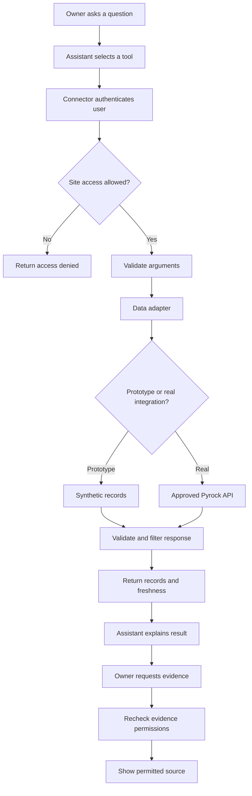

# End-to-end flow

## Example question

“Site A par kitne cement bags bache hain, aur kaunsi delivery pending hai?”

The external assistant handles the question. The connector retrieves authorised records. Pyrock remains the operational source in a real integration; synthetic records stand in for it during the prototype.

## Request and evidence flow

## Steps in detail

1. **Connect an account.** In production the user completes an approved authentication flow. The server associates the identity with permitted tenants and sites. The demo uses synthetic identities.
2. **Resolve the site.** If multiple authorised sites match “Site A,” return choices and ask for clarification.
3. **Select tools.** The assistant calls get_material_balance and list_pending_deliveries. These can run independently after identity and site are established.
4. **Check access and arguments.** Derive identity from authentication; validate site IDs, dates and pagination limits. Reject out-of-scope requests without disclosing other customers' records.
5. **Fetch data.** The adapter uses synthetic SQL records or a future approved Pyrock API. Production credentials stay server-side.
6. **Validate the result.** Check quantities, units, identifiers and timestamps. Preserve unresolved or unavailable states. Apply response filtering even when upstream returns extra fields.
7. **Return facts.** Include request_id, data_mode, source, as_of, fetched_at, evidence references and warnings. Individual records should retain their own update times when they differ.
8. **Explain the answer.** The assistant uses returned values. It should clearly distinguish recorded stock from physical verification and separate received stock from planned deliveries.
9. **Inspect evidence.** A source click passes through a fresh access check or an appropriately short-lived authorised link. Do not expose a public attachment bucket.
10. **Log the operation.** Record actor, permitted site, tool, time, outcome and latency. Avoid logging tokens or full documents by default.

## Synthetic example

| Record | Value |
|---|---|
| Opening recorded stock | 100 bags |
| Confirmed receipts | 450 bags |
| Recorded consumption | 300 bags |
| Pending receipt | 50 bags |
| Last record update | October 1, 2026, 10:30 IST |

Expected result: recorded stock is 250 bags (100 + 450 - 300). Another 50 bags remain pending and are excluded from stock. This simplified example assumes no returns, transfers or adjustments; a real adapter must use Pyrock's actual inventory semantics.

## Expected error behaviour

| Situation | Result |
|---|---|
| No valid authentication | Unauthenticated; request connection/sign-in. |
| Site outside user permissions | Access denied without revealing site details. |
| Unknown material or ambiguous site | Return a controlled clarification result. |
| No stock records | Data unavailable, not zero. |
| Upstream timeout | Clear retryable error; no invented answer. |
| Stale snapshot | Show its timestamp and freshness warning. |
| Evidence permission revoked | Deny access even if an earlier answer contained its reference. |

## Optional future approval branch

For a correction request: prepare a proposed change, show the exact difference and evidence, obtain approval from an authorised reviewer, recheck access and record version, then execute through Pyrock's supported API. Save the action result and audit reference. This branch is outside the first read-only prototype.

## Demo acceptance checklist

- Stock arithmetic matches the labelled example.
- Pending quantities never appear as received stock.
- Both demo users see only their permitted sites.
- Evidence access is independently checked.
- Unknown, empty, stale and failed responses are distinguishable.
- Every screen clearly labels synthetic data.
- Real Muse/Dots compatibility is claimed only after a successful test in that client.
- The repository documents setup, test scenarios, limitations and the adapter replacement path.
